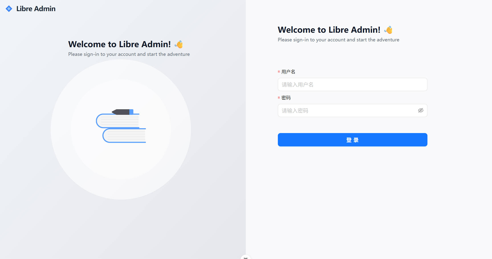
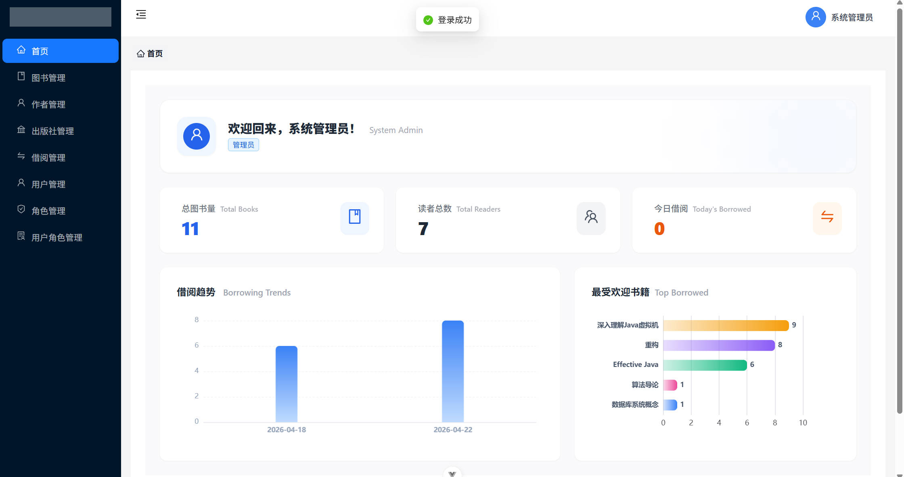
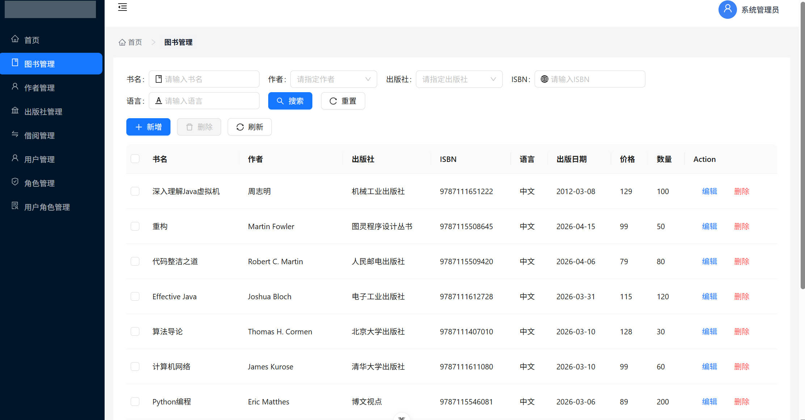
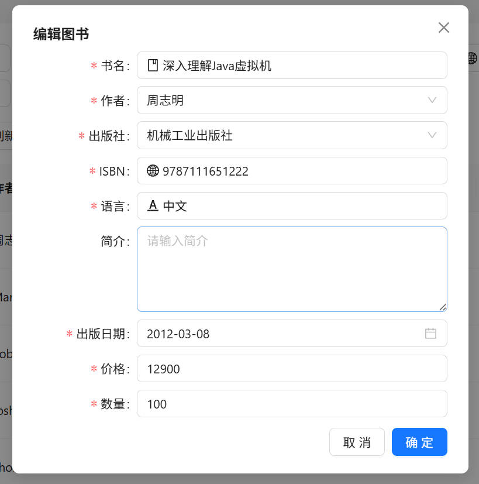
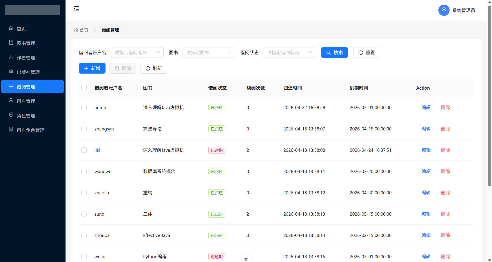

# 图书馆管理系统 (Libre) - 读者端

本仓库为图书馆管理系统的管理后台。

## 🛠 功能模块

- **登录**
- **图书管理**
- **作者管理**
- **出版社管理**
- **借阅管理**
- **用户管理**
- **角色管理**
- **用户角色管理**

## 🛠️ 技术栈

- **核心框架**：`Vue 3.x`、`Vue-Router5.x`
- **状态管理**：`Pinia3.x` (含持久化插件)
- **UI 组件库**：`Ant Design Vue 4.2.6`
- **CSS 框架**：`Tailwind CSS3.x`
- **其他框架**：`dayjs1.11.20`、`axios1.15.0`、`crypto-js4.2.0`
- **构建工具**：`Vite`
- **开发语言**：`TypeScript`

## 🚀 快速启动

1. **依赖下载**：
   推荐使用 pnpm 进行包管理：
   ```bash
   pnpm install
   ```
2. **部署运行**：

   ```
   pnpm run dev
   ```

   - 默认访问地址：`http://localhost:8000`

## 📺 项目展示

### 登录页

**登录**



### 首页



### 管理模块



### 图书编辑



### 借阅管理


